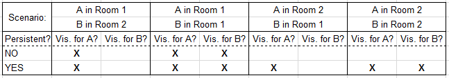
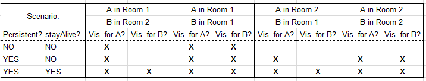

##10. 昼と夜の追加

次に、時刻と昼夜の周期を加えたいと思います。
明らかに、全てのプレーヤの間で時刻の同期を取りたいです。

では、新しい object を作りましょう、ですよね？

...でも待ってください。
（訳補：これまでのように）エンジンを使って単に時刻 object を同期すると、
プレーヤーが各々一つの時刻 object （訳補：のインスタンス）を持つことになります。
プレーヤーが４人ならば４つの時刻 object が存在し、それらは競合してしまいます。

もちろん、
全ての object について（訳補：``htme_isLocal()``を使って）ローカルである場合にのみ時刻を進めるようにはできますが、
それぞれのプレーヤーが個々の時刻カウンタを持つことになり、
それはつまり全く同期していないのと同じことになってしまいます。

**あぁ、もしこれを解決する簡単な方法がありさえすれば...  
いや、待て、あるじゃないか！**

（訳注：なんという自作自演）


``htme_isServer()`` で object が **サーバで create された**のかどうかを検査できます。
これによって、サーバによって制御され、各プレーヤーに対して同期された object を追加できます。
４台のマシンで４つのインスタンスではなく、４台のマシンに１つのインスタンスを扱います。

これがどのように働くか示しましょう。

**新しい object を作り**  ``htme_obj_time`` と命名します。
create event の先頭に次のコードを追加します：

```gml
if (!htme_isServer()) {
   instance_destroy();
   exit;
}
```

「**クライアントである**」という状況を回避しましょう。
つまりインスタンスを作ったら「**サーバーでない**」かを確認し、
そうであったらすぐに**そのインスタンスを破棄**します。
そして（訳補：別途に）**サーバーで制御されたインスタンスをサーバから受信**します。

天才！

このコードの後で、この新しいインスタンスをエンジンに追加します。
これはもちろんクライアント側では決して実行されません。

```gml
mp_sync();
mp_add("time","time",buffer_u16,20*room_speed);
mp_setType("time",mp_type.SMART);
//And at the end we set the time to 1000 - this will be noon
self.time = 1000;
```

（訳：最後に time を 1000 に設定します。これは正午を意味します。）

これで**クライアントは20秒ごとに時刻を受信します**。
そして（訳補：後ほど）クライアント側であってもカウンター（訳注：time 変数のこと）をカウントアップするようにします。
つまり**それぞれのプレーヤーのゲームはそれ自身のカウントアップを行い**、
サーバーは**必要ならその時刻を補正**します。

（訳注：これは「ネットワーク負荷軽減のために頻繁には同期を取らずに各マシンで時刻は進めていくのだが、
大きなずれが無いことを保証するために時々同期を取る」という方式だということです。）

``mp_add`` を使ったので、次のコードを **begin step** に追加します：

```gml
mp_map_syncIn("time",self.time);
```

そして**end step**にこれを加えます：

```gml
self.time = mp_map_syncOut("time", self.time);
```

残る二つのことは時刻をカウントすることと、それを使って実際に何かすることです。


###時刻を進める

``mp_add``を使ったので
``time``変数の全ての変更は ``mp_map_syncIn`` が呼ばれる前に行う必要があることを思い出してください。
このために**begin step の先頭**に新たなコード片を書きます。

```gml
///Increase the time. If time is greater than 2000, set to zero.
self.time++;
if (self.time > 2000) self.time = 0;
```

これは時刻を真夜中を表す 2000 までカウント・アップしていき、
（訳補：それを超えたら）0 （これも真夜中）にリセットします。
1000 が正午です。

このようなサーバで制御されたインスタンスについて、
もしサーバーでのみ action を実行したいのであれば ``if (htme_isLocal()) {}`` を使います。
この文の内側はサーバでのみ実行されます。


###昼と夜

次のコードを**Draw-Event**に貼り付けます。
これは最初の room の背景色を時刻によって変え、くわえて時刻を表示します。
二番目の room は室内（訳補：つまり時刻によらない背景色表示）になります。

```gml
///Draw background
if (room == htme_rom_demo) {
    //Draw night/day
    //This is not a good way of doing it, but I'm not in the mood for that :D
    if (self.time == 0) {
       var bgcolor = make_colour_hsv(170,185,0);
    } else if (self.time <= 1000) {
       var bgcolor = make_colour_hsv(170,185,255/100*(self.time)/10);
    } else if (self.time == 1001) {
       var bgcolor = make_colour_hsv(170,185,255);
    } else if (self.time <= 2000) {
       var bgcolor = make_colour_hsv(170,185,255/100*(1000-self.time)/10);
    }
    draw_set_colour(bgcolor);
    draw_rectangle(0,0,room_width,room_height,false);
    //Draw time as debug on screen
    draw_set_colour(c_white);
    draw_text(room_height-70,70,"Time: "+string(self.time));
} else {
  draw_set_colour(c_maroon);
  draw_rectangle(0,0,room_width,room_height,false);
}
draw_set_colour(c_white);
```


###うまくいきません...

以上行ったことをテストしてみると
**正しく動作しない**ことに気づくでしょう。
``htme_obj_time`` を**persistent**に設定したとしても、
object が**時々消えてしまいます**。
（訳補：[8節](tutorial/8_doors)で示した）表を見返してみましょう。



この表で見て取れるように、
**サーバーが A であって、A が Room 2 に居ると、時刻 object は全てのクライアントから消えます**。
（訳注：他のクライアントは初期位置 Room 1 に居るとした場合。）
あるいは、サーバー（訳補：の役割のプレーヤー A）が Room 1 に居てクライアントが Room 2 に居る場合もそうですし、
もし persistent に設定しないと A から見た時でさえ Room 2 に移動すると消えてしまいます。
悪夢です！

困りました！
新しく作った時刻 object には、何が起ころうとも常に存在していて欲しいです！

まずは **``htme_obj_time`` を persistent に設定します**。
そして **create event での ``mp_sync();`` の後に** 次を加えます：

```gml
mp_stayAlive();
```

これはエンジンに**何が起きてもインスタンスが活動し続けるように**指示します。
これは object が persistent に設定されている場合にのみ有効です！

これを表に加えると、次のようになります：



見て取れるように、
stayAlive が有効であるとインスタンスは常に存在し続けます。


###完了！

時刻と昼夜（訳補：の追加）は完了です。テストしてみましょう！

最後の章へ向かう準備ができました。
最後はチャットシステムです。


---
##10. Adding day and night

Now we want to add time and a day and night cycle. Obviously we want to sync the time between all players.

So let's just create a new object, I guess?

...But wait. If we simply sync a time object using the engine, we will end up having one time object per player. For 4 players that means we would have four time objects fighting over each other.

Of course we could tell all objects to only increase the time when it's locally, but then they would all have their own time counter and that would have the same effect of not syncing them at all.

**Oh, if there would only be an easy way to fix this...  
Oh! Wait! There is!**

You can check if the object was **created on the server** with ``htme_isServer()``. This way you can** add objects that get controlled by the server and synced to each player**. You have 1 instance on 4 PCs, instead of 4 instances at 4 PCs.

Let me show you how this works.

**Create a new object** called ``htme_obj_time``. Add the following code to the beginning of the create event:

```gml
if (!htme_isServer()) {
   instance_destroy();
   exit;
}
```

Let's prevent **I'm a client**:  
I create the instance, **see that I'm not the server**, instantly **destroy it** and then **recieve the instance from the server controlled by the server**.

Genius!

After that bit of code we add the code to add our new object to the engine, which is of course never executed when created clientside:

    ??? "add our new object"
    ??? I think it's better "add our new instance"

```gml
mp_sync();
mp_add("time","time",buffer_u16,20*room_speed);
mp_setType("time",mp_type.SMART);
//And at the end we set the time to 1000 - this will be noon
self.time = 1000;
```

This way the** clients recieve the time every 20 seconds**. We are going to program the counter so, that it counts up, even clientside. That means **each player's game counts up on their own**, and the server **corrects the time if neccessary**.

**Because we used ``mp_add``** we need to add the following code to **begin step**:

```gml
mp_map_syncIn("time",self.time);
```

And this to **end step**

```gml
self.time = mp_map_syncOut("time", self.time);
```

The two things left are counting the time up and actually doing something with it.

###Increasing the time

Remember that, because we use ``mp_add``, all changes to our ``time`` variable need to be made before ``mp_map_syncIn`` is called. Because of that, create a new code block in **position 1 of begin step**:

```gml
///Increase the time. If time is greater than 2000, set to zero.
self.time++;
if (self.time > 2000) self.time = 0;
```

This will count up our time to 2000 which is midnight, and then reset it to 0, which is also midnight. 1000 is noon.

If you want to perform actions on these server controlled instances only by the server use ``if (htme_isLocal()) {}``. Everything inside this statement will only be executed by the server.

### Day and night

Paste the following code into the **Draw-Event**. This will change the background color in the first room depending on time and display the time. Room 2 will be interior.

```gml
///Draw background
if (room == htme_rom_demo) {
    //Draw night/day
    //This is not a good way of doing it, but I'm not in the mood for that :D
    if (self.time == 0) {
       var bgcolor = make_colour_hsv(170,185,0);
    } else if (self.time <= 1000) {
       var bgcolor = make_colour_hsv(170,185,255/100*(self.time)/10);
    } else if (self.time == 1001) {
       var bgcolor = make_colour_hsv(170,185,255);
    } else if (self.time <= 2000) {
       var bgcolor = make_colour_hsv(170,185,255/100*(1000-self.time)/10);
    }
    draw_set_colour(bgcolor);
    draw_rectangle(0,0,room_width,room_height,false);
    //Draw time as debug on screen
    draw_set_colour(c_white);
    draw_text(room_height-70,70,"Time: "+string(self.time));
} else {
  draw_set_colour(c_maroon);
  draw_rectangle(0,0,room_width,room_height,false);
}
draw_set_colour(c_white);
```

### That's not right...

Now when testing what we just did, you might realize that **it doesn't work right**. **Even** if you set ``htme_obj_time`` to be **persistent**, the time object **just vanishes sometimes**. Let's take a look again at our nice table again:


As you can see in this table, **if the server is A and A is in Room 2, the time object will simply disappear on all clients**. Or if the server is in Room 1 and the client(s) in Room 2. And if you don't even set it to be persistent, it even disappears for the server if he is in Room 2. A nightmare!

That's not good! We want our new time object to allways exist, no matter what!

So, first, **set ``htme_obj_time`` to be persistent**. Now,** after the ``mp_sync();`` in the create event** add this:

```gml
mp_stayAlive();
```

This tells the engine to **keep this instance alive, no matter what**. This ONLY works if the object is persistent!

When we add this to our table, things look like this:


As you can see, with stayAlive enabled, the instance always exists.

###Done!

Time and day is done. Test it out!

We are now ready for the final chapter...: A chat system...

    ??? section or chapter?
    ??? Some part of this tutorial refer one web page as "section", but here's "chapter".

---

**» Next topic: [Creating a chat system](tutorial/11_chat)**

« Previous topic: [Making an overlay that shows the name of connected players](tutorial/9_playerlist)
