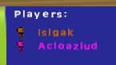

##9. 接続中のプレーヤー名を表示するオーバーレイ

画面の左上隅に表示されるリストを作ります。
この様な見た目のものです：



（訳注：以下の手順は [step 8](../tutorial/8_doors)で room を追加した後の状況から始めています。）

**新しい object を作り** ``htme_obj_playerlist`` と命名、スプライトは無しにします。
persistent に設定し、どちらの room でも（訳補：object が）存在するようにします。
（訳補：初めの room）``htme_rom_demo`` に**配置します**。

この新たな object 自体はエンジンに登録しません。
このオブジェクトは単に全ての存在する ``htme_obj_player`` インスタンスを見て、
それらのメタデータをスクリーンに書きます。

（訳注：メタデータとは一般に、ある事項を記述しているデータがある時に、
そのデータ自身についての情報を記述したデータのこと。
ここでは、何らかのデータを表している object を GMnet で管理するという状況において、
その管理状況についてのデータ、程度の意味。）

これに必要なのは **Draw-Event** だけです。
"Players:" とスクリーンに描画するところから始めましょう：
```gml
draw_set_color(c_white);
draw_text(40,35,"Players:");
```

よし。いいねいいね。
でも、いったい全てのプレーヤー・インスタンスはどうやって得られるのでしょう？
可能性は二つあります：

1. （訳補：GML の機構を使って）``with (htme_obj_player) {/*Code*/}`` として、全てのプレーヤーインスタンスを得る。
2. エンジンが、接続している全てのプレーヤーのリストと、
   特定のプレーヤーによって制御されているインスタンスを得る機能を提供する。

今回の例では初めの解法が最も簡単です。
しかし（訳補：このチュートリアルでは）エンジンを使って何ができるかを伝えたいので、
**二番目の方法を使うことにします**。
一番目の object のインスタンスを（訳補：with 構文で）ループする方が簡単でより適切な場合もあるでしょう。
（例えば、レースゲームで２人のプレーヤーと６人のCPU（NPC、プログラム制御のプレーヤー）が居て、
接続しているプレーヤの情報だけが欲しい場合など）

```gml
var playerlist = htme_getPlayers();
```

これは、全てのプレーヤーのハッシュを含む ``ds_list`` を与えます。
それぞれのプレーヤーはランダムな8文字からなるハッシュによって区別されます。
（訳注：ゲーム・サーバを開始するかそれに接続すると、
GMnet によってそれぞれのマシンに文字列が自動的に割り当てられます。
ここではその文字列をハッシュと呼んでいます。）

このリストの全ての要素を取り出すには、次の for 文によるループを加えます：
```gml
for(var i = 0;i<ds_list_size(playerlist);i++) {
    var player = ds_list_find_value(playerlist,i);
}
```

``player`` はプレーヤーのハッシュ（playerhash と表記）になります。
このハッシュをプレーヤーのインスタンスを得るのに使います。
**for ループの中の ``var player =...`` の後に次のコードを追加します**。:

```gml
var instance = htme_findPlayerInstance(htme_obj_player,player);
```

これは**インスタンスあるいは -1 を返します**。
**そのプレーヤーが自分が居るのとは別の room に居る場合には-1を返します**。
（訳補：その場合は[前節](../tutorial/8_doors)の最後にあるように、）そのプレーヤーのインスタンスは存在しないからです。

**これは問題です**。
だとすると描画するプレーヤーの名前が得られないということを意味するので。
これは、プレーヤーの名前をプレーヤー object に保存していることから来る制限です。
このチュートリアルを読み終わると、この問題は解決できるでしょう。
（その実行はあなたへのチャレンジとしておきます！）

この制限によりプレーヤーインスタンスが存在しない場合には、
単にグレーで "(Other room)" と表示することにします。

```gml
if (instance != -1) {
    var name = (instance).name;
    var _image_blend = (instance).image_blend;
} else {
    var name = "(Other room)";
    var _image_blend = c_gray;
}
```

**``name`` はこれで（訳補：for ループの中で）現在のプレーヤーの名前を保持し、``_image_blend``は色を保持しています**。

**次のコードはスプライトと名前を表示します：**

```gml
//Draw small player icon
draw_sprite_ext(htme_spr_player,0,50,(i)*20+70,0.5,0.5,0,_image_blend,1);
//Draw player name
draw_set_colour(_image_blend);
draw_text(70,(i)*20+62,name);
```

これらはすべて for ループ内に書くことをお忘れなく。

ゲームをスタートしてテストしましょう。
プレーヤーリストはうまく働くでしょう。

（訳注：htme_findPlayerInstance は、正確には、そのプレーヤーに属する最初のインスタンスの ID を返します。
複数の object を同期している場合最初に登録したものについて返されます。
また返しているのはインスタンスそのものではなく ID なので、
そのローカル変数にアクセスするのに丸括弧が必要になっています。）

---
##9. Overlay that shows the name of connected players

We will now create a list that is displayed in the top left corner of the screen and will look something like this:


**Create a new object** ``htme_obj_playerlist`` with no sprite, make it persistent so it exists in both game rooms, and **place it** in ``htme_rom_demo``.

This new object is actually not going to be added to the engine. This object will simply look for all existing ``htme_obj_player`` instances and write their metadata on the screen.

The only thing we'll need is a **Draw-Event**.  
Let's start with drawing the word "Players:" on screen:
```gml
draw_set_color(c_white);
draw_text(40,35,"Players:");
```

Okay, cool, cool. But how on earth do we get all player instances? There are two possibilites:

1. You could use ``with htme_obj_player {/*Code*/}`` to loop through all player instances
2. The engine provides some tools to get a list of all connected players and a function to get an instance that is controlled by a particular player.

    ??? ``with htme_obj_player {/*Code*/}``
    ??? Why threr aren't parens around htme_obj_player?

In our case the first solution is the easiest. However we want to teach you what you can do with the engine, and so **we are going to use the second method**. There might be cases where looping through all instances of an object would be simply to much, for example if you have a race game with 2 players and 6 cpus and you only want to get data of the connected players.

```gml
var playerlist = htme_getPlayers();
```

This will give you a ``ds_list`` containing the hashes of all players. Each player is identifed by a random 8 character hash.

To loop over this list, add the following for-loop:

```gml
for(var i = 0;i<ds_list_size(playerlist);i++) {
    var player = ds_list_find_value(playerlist,i);
}
```

``player`` will now be the playerhash of a player. We use this hash to get a player instance of this player. **Inside the for loop after ``var player =...`` insert the following:**

```gml
var instance = htme_findPlayerInstance(htme_obj_player,player);
```

This will either **return an instance or -**1. It will **return -1 when the player is in another room**, because no instance for this player exists. **And that's a problem**.

    ??? **return an instance or -**1
    ??? 1 shoud be inside bold style.

Because that means we can't actually get the name of the player to display it then. That's a limitation because we store the player name with our player object. After this tutorial is over you should be able to solve this issue, and I challenge you to do so!

Because of this limitation we will simply show "(other room)" in a grey color, when the player instance does not exist:

```gml
if (instance != -1) {
    var name = (instance).name;
    var _image_blend = (instance).image_blend;
} else {
    var name = "(Other room)";
    var _image_blend = c_gray;
}
```

**``name`` now contains the name of the current player and ``_image_blend`` the color.**

**The following code will draw the sprite and the name:**

```gml
//Draw small player icon
draw_sprite_ext(htme_spr_player,0,50,(i)*20+70,0.5,0.5,0,_image_blend,1);
//Draw player name
draw_set_colour(_image_blend);
draw_text(70,(i)*20+62,name);
```

Remember, all of this must go into the for-loop.

Start the game and test it out, our player list should work just fine.

---

**» Next topic: [Adding day/night](tutorial/10_time)**

« Previous topic: [A second room and doors](tutorial/8_doors)
